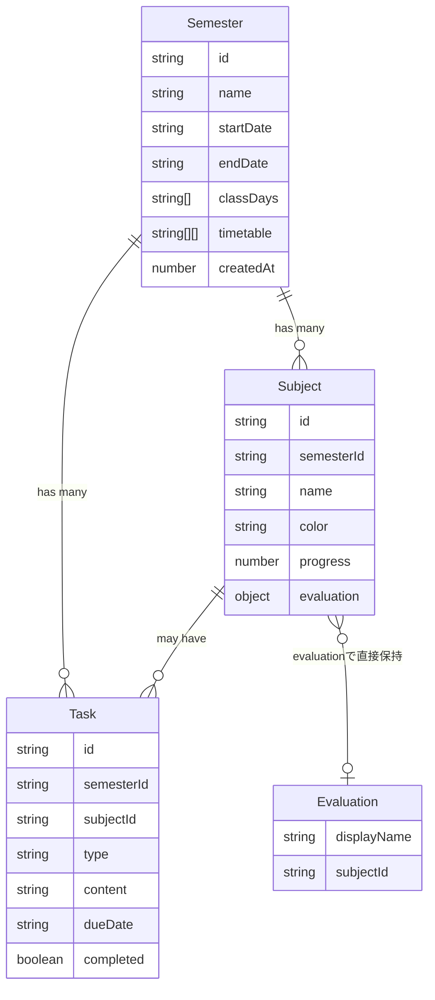
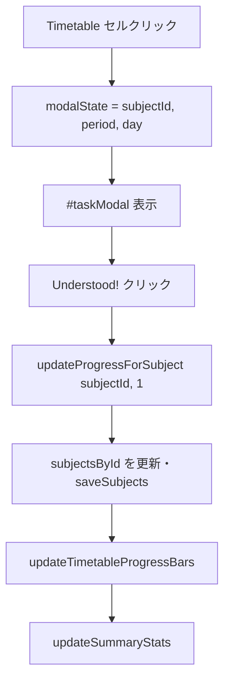
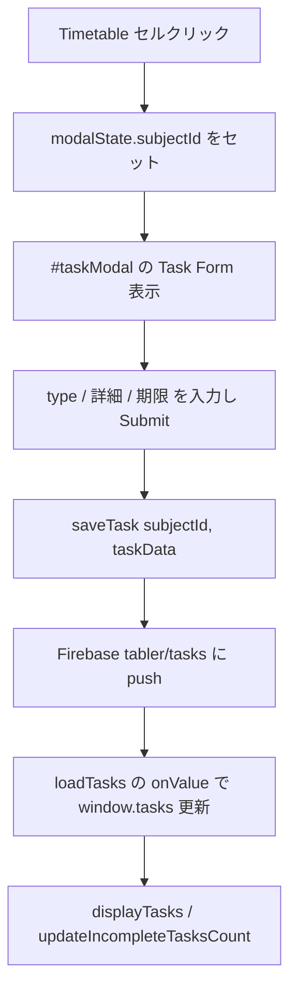

## Tabler/Combi アプリ構造・ロジック計画書

このドキュメントは、現在の `index.html` と `app.js` の実装をもとに、アプリの **データ構造 / 画面構造 / ロジックの流れ** を整理したものです。  
将来的なリファクタリング（モジュール分割・型定義・API整理など）の土台とします。

---

## 1. 全体アーキテクチャ概要

- **フロントエンドのみの SPA 風構成**
  - HTML テンプレート: `index.html`
  - メインロジック: `app.js`（プレーン JS、グローバル関数・変数ベース）
  - スタイル: `styles.css`
- **データ保存レイヤ**
  - オンライン時: Firebase Realtime Database
  - オフライン / フォールバック: `localStorage`
- **主な機能モジュール（論理的なまとまり）**
  - 学期管理（Semester Management）
  - 授業日管理（Class Days Management）
  - 時間割管理（Timetable Management）
  - 科目進捗管理（Subjects Progress）
  - タスク管理（Tasks）
  - 評価データ参照（Evaluations）

---

## 2. データモデル（論理モデル）- Subject ID を Single Source of Truth

### 2.1 エンティティ一覧

- **Semester**
  - `id: string` – 例: `"sem_1731234567890"`
  - `name: string` – 例: `"2025年度 春学期"`
  - `startDate: string` – `"YYYY-MM-DD"`
  - `endDate: string` – `"YYYY-MM-DD"`
  - `classDays: string[]` – 授業日の配列
  - `timetable: string[][]` – 5×5 の 2D 配列。**中身は Subject の id**（空きコマは `""`）
  - `createdAt: number`

- **Subject**
  - `id: string` – 例: `"sub_1731234567890"`（Single Source of Truth）
  - `semesterId: string` – 所属する学期の ID
  - `name: string` – 科目名
  - `color: string` – 背景色（例: `"#FF5733"`）
  - `progress: number` – 進捗（0〜100）
  - `evaluation?: Object|null` – 外部評価データ(シラバス等)のオブジェクトを直接保持
  - **複数コマの共有:** 同じ `name` の科目は時間割編集時に既存 ID を再利用し、週2回・連続コマの授業が1つの Subject（進捗・タスク）を共有する
  - **色の自動割り当て:** 新規作成時はパレットから「currentSubjects で未使用の色」を優先して割り当て。全て使用済みなら先頭からループ。既存科目の再利用時は色は維持される

- **Task**
  - `id: string`
  - `semesterId: string`
  - `subjectId: string` – 紐づく科目の ID
  - `type: "Assignment" | "Report" | "Test"`
  - `content: string`
  - `dueDate: string` – `"YYYY-MM-DD"`
  - `completed: boolean`
  - `createdAt: number`
  - `completedAt?: number`

- **Evaluation**
  - `displayName: string`
  - `subjectId: string`
  - Subject の `evaluation` で直接保持

---

## 3. データモデルの関係（ER 図）



---

## 4. Firebase / localStorage の永続化設計

### 4.1 Firebase 側のパス構造

- `semesters` – `{ [semesterId]: Semester }`
- `subjects/{semesterId}` – `{ [subjectId]: Subject }`
- `tabler/tasks` – `{ [taskId]: Task }`（全タスク。`semesterId` でフィルタ）
- `tabler/currentSemesterId` – `string | null`

### 4.2 localStorage 側のキー構造

- `semestersData` – `Semester[]`
- `currentSemesterId` – 選択中学期 ID
- `subjects_${semesterId}` – `{ [subjectId]: Subject }`

### 4.3 永続化まわりの主要関数

- `loadSemesters()` / `loadSemestersFromLocalStorage()` / `saveSemesters()`
- `loadSubjects()` / `saveSubjects()` – `subjectsById` を保存
- `loadTasks()` – `tabler/tasks` を購読し、`semesterId` でフィルタして `window.tasks` にセット
- `saveTask(subjectId, taskData)` – 新規タスクを Firebase に push
- `persistCurrentSemesterId()` – `currentSemesterId` を Firebase + localStorage に保存

---

## 5. 画面構造と責務（UI 概要）

### 5.1 タブ構成（`index.html`）

- `Timetable` タブ
  - 要素: `#timetable-tab`, `#timetable`
  - 役割: 現在の学期の時間割と進捗バーを表示
- `Tasks` タブ
  - 要素: `#tasks-tab`, `#active-tasks`, `#completed-tasks`
  - 役割: タスクの一覧・完了/未完了の管理
- `Manage` タブ
  - 要素: `#manage-tab`, `#semestersList` ほか
  - 役割: 学期カードの一覧、学期の追加/削除、授業日/時間割の編集

### 5.2 モーダル構造

- `#taskModal`
  - 「理解した / Undo」ボタンによる進捗更新（`progress`）
  - タスク作成フォーム（type / details / due date）
- `#classDaysModal`
  - 学期ごとの授業日管理
  - 月別カレンダー表示・授業日 ON/OFF
- `#timetableModal`
  - セルごとに科目名を入力。保存時に `getOrCreateSubjectByName` で Subject を解決し、ID を `timetable` に格納。**同じ名前の科目は既存 ID を再利用**（週2回・連続コマは1つの Subject で共有）

---

## 6. ロジックフロー（主要ユースケース）

### 6.1 アプリ起動〜初期表示フロー

```mermaid
flowchart TD
  A[ページ読み込み] --> B[Firebase 初期化]
  B --> C[semestersData 読み込み<br/>loadSemesters()]
  C --> D[現学期 ID 決定<br/>currentSemesterId]
  D --> E[時間割データ読み込み<br/>loadTimetable()]
  D --> F[タスク読み込み<br/>loadTasks()]
  D --> G[科目読み込み<br/>loadSubjects() → subjectsById]
  E --> H[時間割描画<br/>generateTimetable(科目IDベース)]
  F --> I[Tasks タブ描画<br/>displayTasks()]
  G --> J[進捗バー・統計更新<br/>updateTimetableProgressBars(), updateSummaryStats()]
```

### 6.2 学期切り替えフロー

```mermaid
flowchart TD
  A[学期カードの Select ボタン] --> B[setCurrentSemesterId()]
  B --> C[persistCurrentSemesterId()]
  B --> D[loadTasks()]
  B --> E[loadSubjects()]
  E --> F[updateTimetableProgressBars(), updateSummaryStats()]
  B --> G[loadTimetable()]
  B --> H[renderSemestersList()]
```

### 6.3 「理解した！」による進捗更新フロー



### 6.4 タスク作成フロー



---

## 7. コード構造（将来の分割案）

現状 `app.js` は 1 ファイルにすべての機能がまとまっているため、将来のリファクタリング方針として次を推奨します。

- **`data/semesters.ts`**
  - `Semester` 型定義
  - `loadSemesters`, `saveSemesters`, `addSemester`, `updateSemester`, `deleteSemester`
- **`data/subjects.ts`**
  - `Subject` 型定義
  - `subjectsById`, `SUBJECT_COLOR_PALETTE`
  - `loadSubjects`, `saveSubjects`, `getSubjectById`, `getSubjectsForSemester`, `createSubject`, `getOrCreateSubjectByName`, `getEvaluationBySubject`
- **`data/tasks.ts`**
  - `Task` 型定義
  - `loadTasks`, `saveTasks`, `createTask`, `toggleTaskComplete` など
- **`ui/timetable.ts`**
  - `generateTimetable`, クリックイベント, モーダル起動
- **`ui/manage.ts`**
  - `renderSemestersList`, `showClassDaysManagement`, `showTimetableManagement`
- **`ui/tasks.ts`**
  - `displayTasks`, タスクタブ UI 制御

---

## 8. 次の一歩（データ構造整理の具体的タスク）

1. **TypeScript での型定義導入**
   - `Semester`, `Subject`, `Task`, `Evaluation` などの `type`/`interface` を定義
2. **データアクセス層の分離**
   - Firebase / localStorage への読み書きを「データアクセスモジュール」に切り出す
3. **UI ロジックの分割**
   - Timetable / Tasks / Manage / Modals ごとにファイルを分ける
4. **テスト用ダミーデータの整備**
   - 1 学期ぶんのサンプル `Semester` / `Subject` / `Task` を用意し、UI をスタブで確認できるようにする

このドキュメントを起点に、必要に応じて「より詳細なクラス図」「状態遷移図」「API I/F 定義」などを追加していく想定です。

